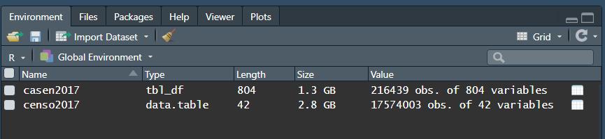

# data-chile

Bases de datos de Chile para ser empleadas principalmente desde R

* Bases fueron previamente importadas a R y guardadas en formato .RData para facilitar su uso.


# Cargar las bases de datos en R

El siguiente código permite descargar las bases de datos directamente desde el repositorio.


## Encuesta CASEN 2017
```
load(url("https://github.com/jciturras/data-chile/blob/main/data/casen-2017/casen-2017.RData?raw=true"))
```

## Censo 2017

```
load(url("https://github.com/jciturras/data-chile/blob/main/data/censo-2017/censo-2017.RData?raw=true"))
```

